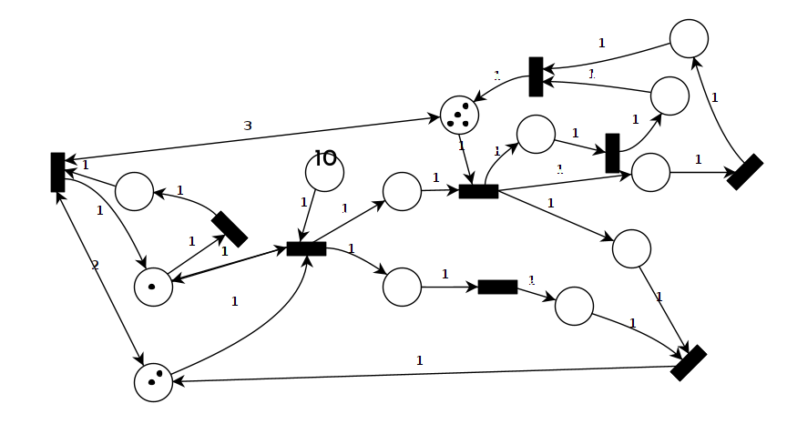

# John Chandara’s Encrypt 352

The purpose of this project is to implement a multi-threaded text file encryptor. Conceptually, the function of the program is simple: to read characters from an input source, encrypt the text, and write the encrypted characters to an output. Also, the encryption program counts the number of occurrences of each letter in the input and output files. All I/O and encryption is performed by a module (encrypt-module.c) that is supplied by the project.

## How to compile

1. Ensure your environment has `pthreads`, `cmake` and `make`.
2. Run `cmake .` in the root working directory to generate the Makefile
3. Run `make` for build the program.

## Components

* `Vendor` - Provided implementation or helper code assisting implementation.
* `Fkworks0` - Debug and utilities.

## Concurrency Inspiration

The concurrent of this project is primarily built off of the following T-type Petri-net design and ported over a C-implementation with the help of P.  Jackubco and S. Šimonak’s paper on the design and analysis of concurrent algorithms.

If we take a closer look at the reading section (shown below), we’ll notice a pattern used throughout the rest of the diagram where all semaphores and coroutines are represented as places and transitions, respectively.

A noteworthy design decision come in the relationship of the “free buffer slot” transition with it’s outgoing and incoming places. This mechanism as a whole allows us to control how many characters are places within the input buffer at a time.